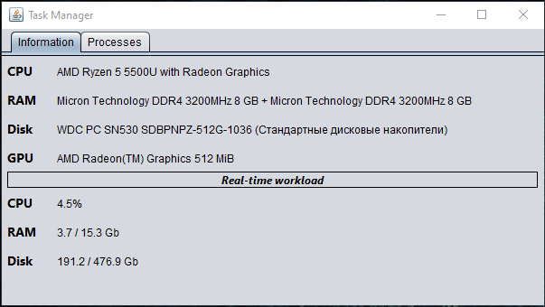
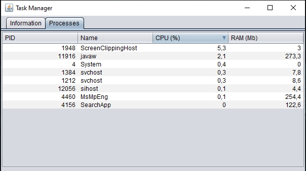
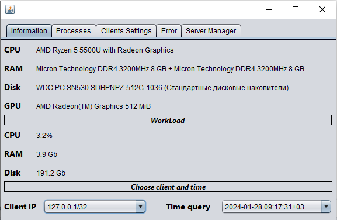
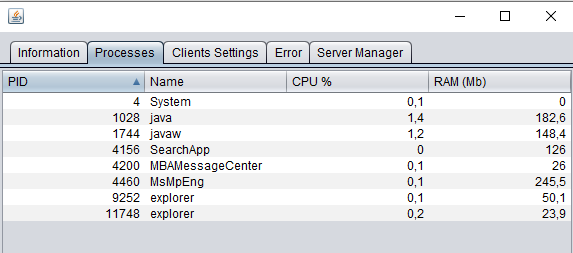
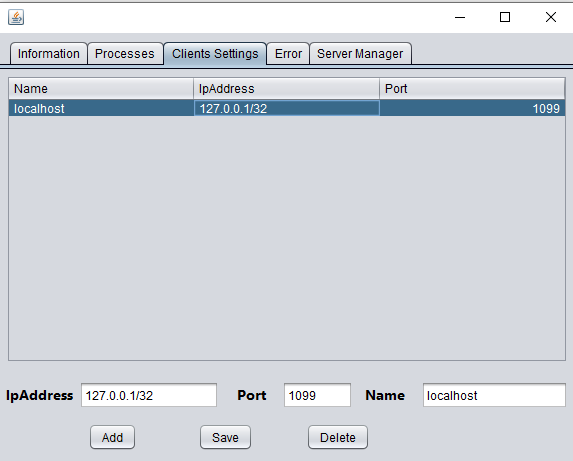
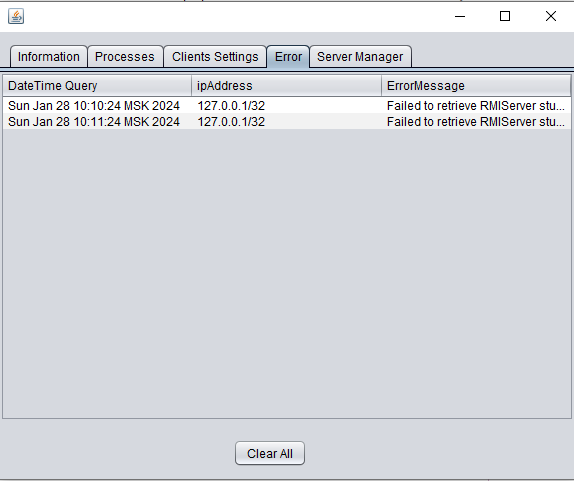
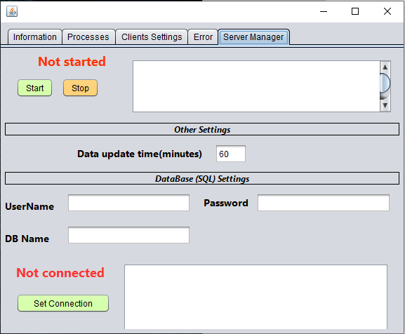
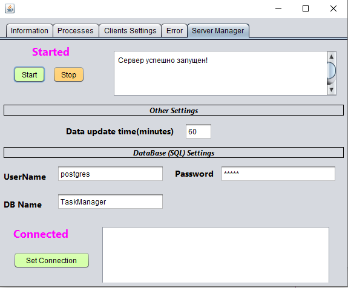
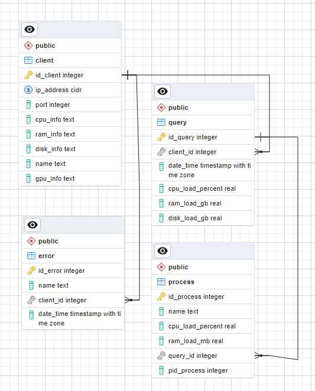

# Task Manager
A task manager with a client-server implementation for remote monitoring of clients.
## Applied technologies
- Swing (GUI)
- JMX (Client-Server)
- OSHI (Operating System and Hardware Information library for Java) [https://github.com/oshi/oshi/tree/master]
- PostgreSQL (Storing customer information)

## Supported platforms
- Windows
- Linux

## Getting started
- Download the project to your PC;
- Unzip the archive if you downloaded the zip file;
- (Server) Install postgreSQL [https://www.postgresql.org/download/]
- (Server) Create a database without tables;
- On Linux:
```sh
sudo apt install openjdk-21-jre
```


### Running the Client
1. Go to TaskManager/JarFiles;
2. Open cmd/terminal in this folder and paste the command:
  - Running with JVM settings for JMX:
```sh
java -Dcom.sun.management.jmxremote.port=1099 -Dcom.sun.management.jmxremote.authenticate=false -Dcom.sun.management.jmxremote.ssl=false -jar Client.jar
```
  - Running without JVM settings:
```sh
java -jar Client.jar
```
### Running the Server
- Go to TaskManager/JarFiles;
- Open cmd/terminal in this folder and paste the command:
```sh
java -jar Server.jar
```
- Establish a connection with the database;
- Start the server.

## Screenshots
### Client



### Server







### DataBase ERD


## Notes
- Launching on windows is possible by double clicking on the jar file;
- On Windows, when the client is launched by double-clicking, information exchange with the server will be unavailable;
- At the moment, errors are not entered into the database, they are only displayed on the 'Error' tab on the server;
- The difference between v1 and master branches is only in the structure of the code. The master branch contains a new structure.

